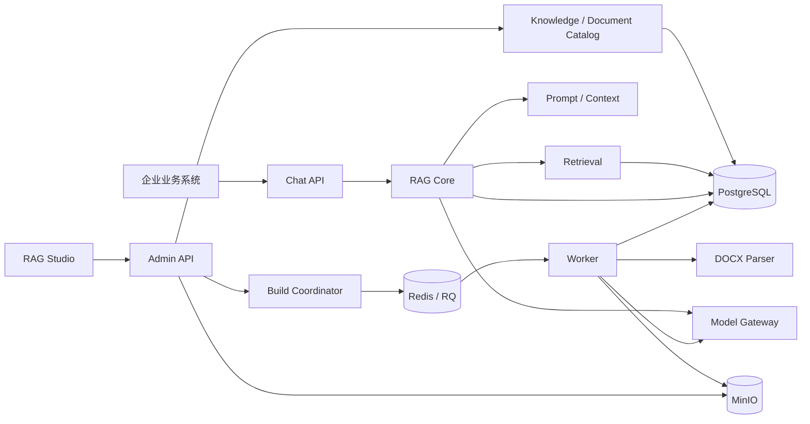

# V1 总体架构

## 1. 目标与边界

本系统为企业业务软件提供产品文档问答能力。企业将 DOCX 文档加入指定知识库，系统生成可发布索引；业务系统调用 Chat API 时明确传入 `knowledge_id`，系统只基于该知识库当前 Active Index 生成回答并返回可追溯来源。

系统不是通用聊天机器人、Agent 平台或本地模型托管平台。所有 AI 能力通过 Model Gateway 调用云端 API。

### V1 包含

- 多知识库，但不提供多租户隔离模型
- DOCX 文本、简单表格和图片解析
- OCR、Vision Caption、图片及图文混合 Embedding
- Vector Search、严格 BM25、RRF Hybrid Fusion 和 VL Rerank
- 全局 Prompt、多轮对话上下文、SSE 和来源引用
- RAG Studio 管理和调试后台

### V1 不包含

- 用户登录、角色权限和租户管理
- Agent、工具调用或可视化工作流
- 本地 LLM、Embedding、OCR、Vision 或 Rerank 推理
- 自动评测平台
- 用户可见的历史文档版本管理

无登录不等于无访问控制。生产环境除健康检查外的接口必须处于可信网络或由服务级凭据/API 网关保护；浏览器端不得持有长期服务密钥。

## 2. 逻辑架构



## 3. 运行组件

### FastAPI Backend

职责：

- Admin REST API 与 Chat SSE API
- 知识库、逻辑文档、索引、任务和 Trace 管理；模型与 Prompt 只读查询
- 构建请求合并与索引发布协调
- RAG 在线流程编排
- 请求鉴权、参数校验、错误映射和结构化日志

在线 API 不执行耗时的 DOCX 解析、OCR、Vision 或 Embedding。

### RQ Worker

职责：

- 下载并校验 DOCX
- Mammoth 与 OOXML 解析
- 图片提取、OCR、Vision Caption
- Element 与 Chunk 生成
- 批量 Embedding
- 写入索引快照数据和处理状态

Worker 与 Backend 共用领域模型、Repository、配置和 Model Gateway 代码。RQ Job ID 只用于队列诊断，业务任务由 `task_record.id` 唯一标识。

### Provider 适配层（代码中没有独立的 `model_gateway` 包）

提供五类稳定接口：

- `LLMProvider`
- `EmbeddingProvider`
- `RerankProvider`
- `OCRProvider`
- `VisionProvider`

Provider 工厂分散在 `ingestion/embedding.py`、`ingestion/image_understanding.py`、`rag/rerank.py` 和 `rag/llm.py`，对业务服务提供统一接口。各 Provider 负责其适用的超时、重试、响应校验、用量、上游请求 ID 与日志脱敏；业务编排不直接解析厂商 HTTP 响应结构。

目标模型配置为：

| 类型 | Provider | 目标模型 |
|---|---|---|
| Embedding | SiliconFlow | `Qwen/Qwen3-VL-Embedding-8B` |
| Rerank | SiliconFlow | `Qwen/Qwen3-VL-Reranker-8B` |
| OCR | SiliconFlow | `deepseek-ai/DeepSeek-OCR` |
| LLM | 智谱 AI | `glm-5.2` |
| Vision | 智谱 AI | `glm-5v-turbo` |

这些是产品目标配置。M0 提供官方契约基线和真实在线探测器；只有脱敏在线报告全部通过后，才能把当次端点、字段、流式格式和模型可用性视为已验证事实。

### PostgreSQL

存储：

- 知识库和文档目录
- 索引快照、Element、Chunk 与向量
- BM25 索引
- Prompt、模型配置元数据
- Conversation、Message 与 RAG Trace
- 业务任务状态

`pgvector` 负责向量检索；严格 BM25 的部署决策见 ADR-0001。

### MinIO

保存：

- 原始 DOCX
- 提取图片
- 必要的中间或调试资产

Bucket 默认私有。当前 OCR、Vision 和 Rerank Provider 读取对象后，按厂商协议传递受限字节或 `data:` Base64 图片；当前实现不生成永久公开 URL。短期签名 URL 是兼容选项，不是当前调用路径。

### Redis / RQ

Redis 仅承担队列、短期锁和任务协调，不作为业务事实数据源。任务状态、错误和重试计数必须同步记录到 PostgreSQL。

## 4. 代码模块边界

当前后端模块：

```text
backend/app/
├── api
├── common
├── core
├── ingestion
├── rag
├── services
├── tasks
├── main.py
└── worker.py
```

- `api` 只做传输层工作，不直接拼检索 SQL 或调用厂商 API。
- `ingestion.repository` 与 `rag.repository` 封装持久化，不包含 Prompt 或模型业务逻辑。
- `ingestion` 负责离线索引数据生成，包括 DOCX 校验/解析、Chunk、Embedding 和图片理解 Provider。
- `rag` 包含候选召回、RRF、Rerank、Prompt、LLM Provider、来源构造及其 Repository。
- `services.ingestion` 与 `services.rag` 编排 API 使用的业务流程；`tasks` 负责 RQ 入口、恢复和清理。

## 5. 全局架构不变量

1. 在线检索必须先解析 `knowledge_base.active_index_id`，并同时用 `kb_id` 和 `index_id` 过滤。
2. `ACTIVE` 索引发布后不可原地新增、删除或修改 Element、Chunk 和 Embedding。
3. 只有状态为 `READY` 且通过完整性检查的索引可以激活。
4. 索引切换必须在单个数据库事务中完成；失败时旧 Active Index 保持可用。
5. 同一知识库同一时刻最多有一个 `BUILDING` 索引。
6. 文档目录变更发生在构建期间时，不修改当前构建快照，而是设置 `rebuild_required` 并在当前构建完成后合并触发下一次构建。
7. 所有 Chunk 必须可追溯到知识库、索引、逻辑文档和至少一个 Element。
8. 来源结构由服务端检索元数据生成；LLM 只能引用服务端分配的来源编号。
9. 所有已发布 Chunk 必须具有合法 Embedding，并与部署级固定的 `EMBEDDING_DIMENSION` 一致；普通索引重建不得改变维度。
10. API Key、Authorization Header 和 MinIO Secret 禁止进入普通日志、Trace、Prompt 或 API 响应。
11. 外部模型失败不得破坏 Active Index；构建失败和在线降级必须可观测。
12. 时间统一以 UTC 保存，公开 ID 统一使用 UUID。

## 6. 可用性与一致性目标

V1 不冻结具体 SLA 数字，但实现必须支持以下行为：

- 构建和清理不阻塞在线 Chat。
- 上游 Rerank 失败时可以按融合排序降级，并记录 Trace。
- 上游 LLM 失败时返回结构化错误，不伪造答案。
- OCR 或 Vision 单项失败可将图片标记为降级；Chunk Embedding 失败则索引不得发布。
- 客户端断开 SSE 时应取消上游流式请求并停止无用生成。
- 所有请求、任务和 Trace 可通过 `request_id`、`task_id`、`trace_id` 关联。

性能、容量、保留期和超时的具体数值属于 M1/M4 的配置基线，需用真实样例文档和模型压测确定。

## 7. 后续变更入口条件

对当前 V1 基线做功能或依赖变更前必须：

- 更新受影响的契约文档，并确认运行中的 OpenAPI、当前源代码与说明一致；
- 对 ADR-0001 的许可证和部署方式重新评估，若引入分发、修改或数据库客户端边界变化则新增 ADR；
- 保持 `EMBEDDING_DIMENSION=1024`，或为维度变更设计 Schema/向量索引迁移和全量重建；
- 冻结并记录 Python、Node、PostgreSQL、扩展和生产镜像版本；
- 使用非生产凭据执行云模型契约验证，或明确使用 Fake Provider，并对涉及 `0007`/`0008` 的发布重新执行验收。
