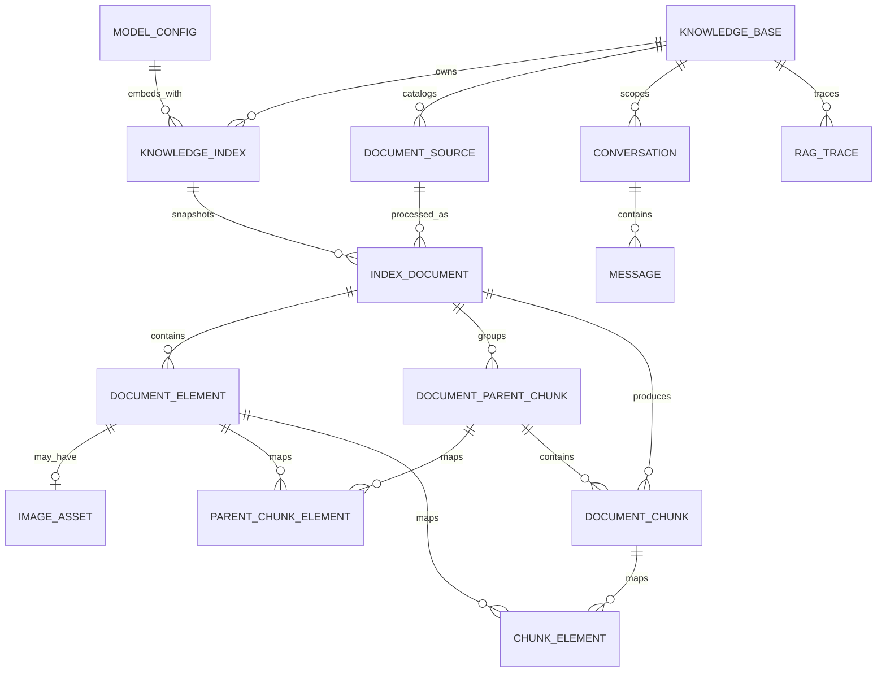

# V1 逻辑数据模型

本文描述当前 Alembic `0008` Schema 的逻辑模型与一致性规则。具体 SQL 类型、索引语法和命名以 `backend/alembic/versions/` 为准；涉及后续演进的目标性规则会明确标注，不能被当作已存在的运行时检查。

## 1. 通用约定

- 主键：UUID。
- 时间：`timestamptz`，UTC。
- JSON：`jsonb`，非空字段默认 `{}` 或 `[]`。
- 文件哈希：SHA-256 小写十六进制。
- 公开 ID 不使用数据库自增序列。
- 枚举优先由数据库约束或 PostgreSQL enum 保证，不能只在前端限制。
- 软删除只用于逻辑目录实体；索引快照的物理清理由受控任务执行。

## 2. 关系概览



## 3. 核心表

### `knowledge_base`

| 字段 | 约束/说明 |
|---|---|
| `id` | PK, UUID |
| `name` | 非空，名称在 V1 全局唯一 |
| `description` | 可空 |
| `status` | `ENABLED` / `DISABLED` |
| `active_index_id` | 可空，FK → `knowledge_index.id`，删除限制 |
| `rebuild_required` | 非空，默认 `false` |
| `created_at` | 非空 |
| `updated_at` | 非空 |

API 根据数据计算 `runtime_state`：

- `EMPTY`：没有 Active Index，也没有运行中构建。
- `BUILDING`：没有 Active Index，但存在构建。
- `READY`：有 Active Index，且没有失败影响在线服务。
- `UPDATING`：有 Active Index，同时存在构建或 `rebuild_required=true`。
- `DEGRADED`：有 Active Index，但最近一次构建失败。
- `ERROR`：没有 Active Index，且最近一次构建失败。
- `DISABLED`：知识库被停用。

数据库必须或应用事务必须验证 `active_index_id` 对应索引的 `kb_id` 等于本行 `id`，且状态为 `ACTIVE`。

### `knowledge_index`

| 字段 | 约束/说明 |
|---|---|
| `id` | PK |
| `kb_id` | FK → `knowledge_base.id` |
| `version` | 同一知识库内单调递增 |
| `status` | `BUILDING` / `READY` / `ACTIVE` / `DEPRECATED` / `FAILED` / `DELETING` |
| `embedding_model_id` | FK → `model_config.id` |
| `embedding_model_name` | 构建时快照 |
| `embedding_dimension` | 正整数，记录构建快照；必须等于部署级固定维度 |
| `bm25_engine` | 构建时引擎与版本快照 |
| `document_count` | 默认 0 |
| `element_count` | 默认 0 |
| `chunk_count` | 默认 0 |
| `build_reason` | `INITIAL` / `DOCUMENT_CHANGED` / `REPROCESS` / `MODEL_CHANGED` / `MANUAL` |
| `error_code` | 可空 |
| `error_message` | 可空，禁止保存凭据 |
| `created_at` | 非空 |
| `finished_at` | 可空 |
| `activated_at` | 可空 |

约束：

- 唯一 `(kb_id, version)`。
- 同一 `kb_id` 最多一个 `BUILDING`，通过部分唯一索引或事务锁保证。
- 同一 `kb_id` 最多一个 `ACTIVE`。
- `READY`、`ACTIVE`、`DEPRECATED` 索引的 `finished_at` 非空。
- 激活后内容不可变；只允许更新生命周期状态和清理元数据。

### `document_source`

用户可见的逻辑文档，不代表某次索引处理结果。

| 字段 | 约束/说明 |
|---|---|
| `id` | PK |
| `kb_id` | FK → `knowledge_base.id` |
| `filename` | 原始文件名 |
| `display_name` | 可编辑显示名 |
| `minio_bucket` | 非空 |
| `minio_object_key` | 非空且全局唯一 |
| `file_hash` | SHA-256 |
| `file_size` | 字节数，非负 |
| `mime_type` | DOCX MIME |
| `status` | `STORED` / `DELETED` |
| `created_at` | 非空 |
| `updated_at` | 非空 |
| `deleted_at` | 可空 |

同一知识库内未删除文档建议唯一 `(kb_id, file_hash)`。删除逻辑文档不会修改 Active Index；变更在下一次构建发布后生效。

### `index_document`

| 字段 | 约束/说明 |
|---|---|
| `id` | PK |
| `index_id` | FK → `knowledge_index.id`，索引清理时级联 |
| `document_id` | FK → `document_source.id`，删除限制 |
| `source_hash` | 构建时文件哈希快照 |
| `status` | 见下方处理状态 |
| `page_count` | 可空；仅在可靠固定版式渲染存在时赋值 |
| `error_code` | 可空 |
| `error_message` | 可空、脱敏 |
| `started_at` | 可空 |
| `finished_at` | 可空 |
| `created_at` | 非空 |

唯一 `(index_id, document_id)`。

处理状态：

```text
QUEUED
PARSING
PROCESSING_IMAGES
CHUNKING
EMBEDDING
READY
FAILED
```

### `document_element`

| 字段 | 约束/说明 |
|---|---|
| `id` | PK |
| `index_id` | FK → `knowledge_index.id` |
| `index_document_id` | FK → `index_document.id` |
| `document_id` | FK → `document_source.id` |
| `element_type` | `TEXT` / `TABLE` / `IMAGE` |
| `sequence_no` | 文档内从 1 开始的稳定顺序 |
| `content` | 标准化文本；IMAGE 可以为空但图片资产不得为空 |
| `section_path` | JSON 字符串数组 |
| `metadata` | 样式、OOXML 关系、段落/表格序号等 |
| `created_at` | 非空 |

唯一 `(index_document_id, sequence_no)`。`index_id` 和 `document_id` 是检索及一致性校验所需的显式冗余字段，必须与 `index_document` 保持一致。

### `image_asset`

| 字段 | 约束/说明 |
|---|---|
| `id` | PK |
| `index_id` | FK → `knowledge_index.id` |
| `index_document_id` | FK → `index_document.id` |
| `document_id` | FK → `document_source.id` |
| `element_id` | 唯一 FK → `document_element.id` |
| `minio_bucket` | 非空 |
| `minio_object_key` | 非空 |
| `file_hash` | SHA-256 |
| `mime_type` | 非空 |
| `width` / `height` | 可空，正整数 |
| `ocr_text` | 可空 |
| `vision_caption` | 可空 |
| `ocr_status` | `PENDING` / `READY` / `FAILED` / `SKIPPED` |
| `vision_status` | 同上 |
| `ocr_provider` / `ocr_model_name` | OCR Provider 与模型快照 |
| `vision_provider` / `vision_model_name` | Vision Provider 与模型快照 |
| `ocr_error_code` / `vision_error_code` | 单项失败的脱敏错误码 |
| `processed_at` | 图片理解完成时间 |
| `metadata` | 上游模型、请求 ID、降级信息，不含密钥 |
| `created_at` | 非空 |

索引清理时删除对应图片对象。原始 DOCX 对象属于 `document_source`，不能随单个旧索引清理。

### `document_parent_chunk`

由 `0008` 引入的完整回答单元；章节过长时可使用连续的 `SECTION_WINDOW`。

| 字段 | 约束/说明 |
|---|---|
| `id` | PK |
| `kb_id` / `index_id` / `index_document_id` / `document_id` | 显式外键，均属于同一个索引快照和逻辑文档 |
| `parent_type` | `SECTION` / `SECTION_WINDOW` |
| `sequence_no` | 文档内 Parent 顺序，正整数 |
| `content` | 完整回答单元内容 |
| `token_count` | 正整数 |
| `section_path` / `metadata` | JSONB，章节路径与构建元数据 |
| `created_at` | 非空 |

唯一 `(index_document_id, sequence_no)`。`parent_chunk_element` 保存 Parent 与 Element 的多对多溯源，PK 为 `(parent_id, element_id)`，并唯一 `(parent_id, ordinal)`。

### `document_chunk`

| 字段 | 约束/说明 |
|---|---|
| `id` | PK |
| `kb_id` | FK → `knowledge_base.id` |
| `index_id` | FK → `knowledge_index.id` |
| `index_document_id` | FK → `index_document.id` |
| `document_id` | FK → `document_source.id` |
| `chunk_type` | `TEXT` / `TABLE` / `IMAGE` / `MIXED` |
| `sequence_no` | 文档内 Chunk 顺序 |
| `content` | 给 Context/LLM 使用的规范内容 |
| `search_text` | 给 BM25 使用的纯文本表示 |
| `token_count` | 使用构建时 tokenizer 的计数或一致估算 |
| `embedding` | `vector(N)`；N 是部署级固定维度 |
| `section_path` | JSON 字符串数组 |
| `parent_id` | 可空 FK → `document_parent_chunk.id`；`0008` 后新建快照应关联所属 Parent |
| `previous_chunk_id` / `next_chunk_id` | 可空自引用 FK；同一 Parent 的相邻 Child Chunk |
| `suspected_incomplete` | 非空布尔值，默认 `false` |
| `incomplete_reasons` | JSON 字符串数组，默认 `[]` |
| `is_procedural` | 非空布尔值，默认 `false` |
| `metadata` | Chunk 参数、图像引用等 |
| `created_at` | 非空 |

唯一 `(index_document_id, sequence_no)`。常用索引至少覆盖：

- `(kb_id, index_id)`；
- `(index_id, document_id)`；
- `(parent_id, sequence_no)`；
- `(index_id, suspected_incomplete, is_procedural)`，供相邻 Chunk 扩展使用；
- 向量 ANN 索引；
- `search_text` 的 BM25 索引。

### `chunk_element`

Chunk 与 Element 的多对多溯源表：

| 字段 | 约束/说明 |
|---|---|
| `chunk_id` | FK → `document_chunk.id` |
| `element_id` | FK → `document_element.id` |
| `ordinal` | Element 在 Chunk 中的顺序 |

PK `(chunk_id, element_id)`，并唯一 `(chunk_id, ordinal)`。同一映射中的 Chunk 与 Element 必须属于相同 index、document。

## 4. 配置与会话表

### `model_config`

| 字段 | 约束/说明 |
|---|---|
| `id` | PK |
| `name` | 唯一 |
| `model_type` | `LLM` / `EMBEDDING` / `RERANK` / `OCR` / `VISION` |
| `provider` | 稳定 provider 标识 |
| `base_url` | 非空、受校验 |
| `api_key_ciphertext` | API Key 加密密文，不通过普通 API 返回 |
| `api_key_nonce` | 认证加密随机数/Nonce |
| `api_key_key_version` | 主密钥版本，用于轮换 |
| `model_name` | 非空 |
| `parameters` | JSONB |
| `enabled` | 布尔值 |
| `created_at` / `updated_at` | 非空 |

每个 `model_type` 最多一个 `enabled=true` 的配置。`enabled` 表示“供新请求或新构建选择”，不表示可以立即删除历史配置；被 Active Index 引用的旧 Embedding 配置即使不再 enabled，也必须保持可解析和可调用，直到相关知识库完成重建。

公开 API 提供模型配置的安全只读快照（`GET /api/v1/models`），并为 `LLM` / `RERANK` 行提供管理写入入口 `PATCH /api/v1/models/{id}`（可更新 `model_name`、`base_url`、`parameters`、`enabled`）。`begin_turn` 每轮读取该表快照，因此写入在下一轮对话即生效、无需重启；Provider 实际使用的 API Key 仍来自运行时 `Settings`（环境变量/Secret 注入）。Embedding/OCR/VISION 与索引构建绑定，不支持在线调整。Schema 预留的加密密钥字段的写入、轮换和解密供 Provider 调用的工作流尚未实现。

Embedding 配置启用前必须声明并通过契约测试验证输出维度。V1 的 `document_chunk.embedding` 使用部署级固定 `vector(N)`：更换模型只有在输出相同 N 时才能通过普通新索引逐步发布。改变 N 需要新的 ADR、Schema/向量索引迁移、双写或维护窗口方案以及所有知识库重建，不能仅创建一个不同维度的 Knowledge Index。

### `rag_config`

单行（`id CHECK = true`）全局检索参数表，由管理界面通过 `GET/PATCH /api/v1/rag-config` 读写：

| 字段 | 约束/说明 |
|---|---|
| `id` | 恒为 `true`，保证仅一行 |
| `vector_top_k` / `bm25_top_k` | 双路召回候选数 |
| `fusion_top_k` | RRF 融合后进入重排的数量 |
| `rerank_top_n` | 重排后保留的候选数 |
| `context_max_chunks` | 送入 LLM 的上下文章节上限 |
| `created_at` / `updated_at` | 非空 |

`begin_turn` 每轮读取该表快照进入 `Turn.retrieval`，行缺失时回退 `Settings` 默认值；Playground 的手动参数在同一层覆盖，行为不受影响。

### `prompt_template`

| 字段 | 约束/说明 |
|---|---|
| `id` | PK |
| `name` | 非空 |
| `version` | 正整数 |
| `content` | 非空 |
| `active` | 布尔值 |
| `created_at` | 非空 |

唯一 `(name, version)`；全局最多一个 `active=true`。必须支持变量 `{{context}}`、`{{question}}`、`{{history}}`，启用前执行模板变量校验。

### `conversation`

| 字段 | 约束/说明 |
|---|---|
| `id` | PK |
| `knowledge_id` | FK → `knowledge_base.id` |
| `created_at` / `updated_at` | 非空 |

Conversation 创建后不能切换知识库。

### `message`

| 字段 | 约束/说明 |
|---|---|
| `id` | PK |
| `conversation_id` | FK → `conversation.id` |
| `role` | `USER` / `ASSISTANT` |
| `content` | 非空 |
| `sources` | ASSISTANT 消息的结构化来源 JSON，可空 |
| `status` | `STREAMING` / `COMPLETED` / `FAILED` / `CANCELLED` |
| `created_at` | 非空 |

### `rag_trace`

| 字段 | 约束/说明 |
|---|---|
| `id` | PK |
| `trace_id` | 唯一、公开诊断 ID |
| `request_id` | 请求关联 ID |
| `kb_id` / `index_id` | 本次请求实际使用的快照 |
| `conversation_id` / `message_id` | 可空关联 |
| `question` | 可按配置截断或脱敏 |
| `retrieval_result` | JSONB |
| `rerank_result` | JSONB |
| `selected_context` | JSONB |
| `prompt` | 可空，按保留策略保存 |
| `answer` | 可空 |
| `sources` | JSONB |
| `model_usage` | JSONB |
| `latency` | JSONB，各阶段毫秒数 |
| `status` | `RUNNING` / `COMPLETED` / `FAILED` / `CANCELLED` |
| `error` | 脱敏 JSONB |
| `created_at` / `finished_at` | 时间 |

## 5. 任务表

### `task_record`

| 字段 | 约束/说明 |
|---|---|
| `id` | PK，业务任务 ID |
| `rq_job_id` | 可空、可重建 |
| `task_type` | `INDEX_BUILD` / `INDEX_DOCUMENT` / `INDEX_CLEANUP` 等 |
| `kb_id` / `index_id` / `document_id` | 按任务类型可空 |
| `status` | `PENDING` / `RUNNING` / `SUCCEEDED` / `FAILED` / `CANCELLED` |
| `attempt` | 当前尝试次数 |
| `max_attempts` | 最大尝试次数 |
| `progress` | 0–100，可空 |
| `error_code` / `error_message` | 可空、脱敏 |
| `created_at` / `started_at` / `finished_at` | 时间 |

业务幂等键由任务类型决定，例如 `INDEX_DOCUMENT:index_id:document_id`，并通过唯一约束防止重复并发处理。

## 6. 发布完整性检查

当前 `_finalize_index` 在同一事务中直接检查：

1. 索引内所有 `index_document` 均为 `READY`；
2. `index_document`、`document_element` 和 `document_chunk` 的计数均大于零；
3. 用实际行数写回 `knowledge_index` 的统计字段，再将索引变为 `READY`，并按配置原子激活。

Embedding Provider 在写入前还校验批次数、固定维度和有限数值；FK、唯一约束和构建路径保证其余多项局部一致性。以下仍是应由发布前审计覆盖的更强不变量，但目前不是 `_finalize_index` 的独立全表审计：每个 Chunk 的 Element 映射、所有冗余 ID 的交叉一致性、BM25 可查询性，以及该索引不存在运行中任务。若这些条件需要成为发布硬门禁，应先补充实现与测试，不能仅依赖本文。

## 7. 删除语义

- 删除文档：软删除 `document_source`，请求新构建；当前 Active Index 在切换前仍包含旧内容。
- 删除知识库：Schema 支持 `DISABLED`，但当前没有知识库停用或删除公开 API。
- 删除索引：`DEPRECATED` 或 `FAILED` 可进入 `DELETING`；`ACTIVE` 与 `BUILDING` 禁止删除。显式删除会绕过保留策略。
- 当前没有模型配置删除或禁用公开 API。
- 清理索引时，数据库子记录和该索引专属 MinIO 图片一并删除；为满足外键约束，关联 `rag_trace` 也会先物理删除。原始 DOCX 保留到逻辑文档被安全清理。
