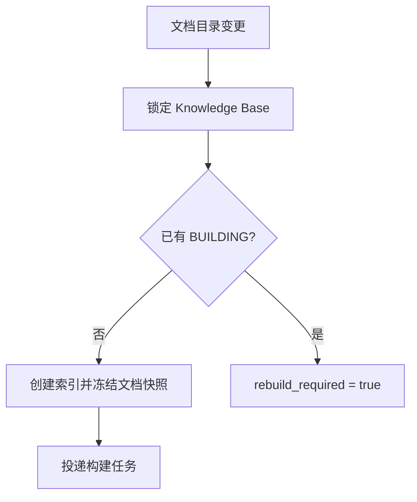
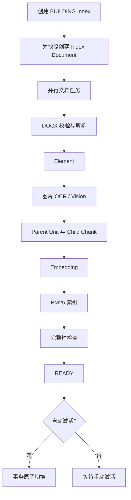

# DOCX 摄取与索引构建契约

## 1. 目标

摄取链路将逻辑 DOCX 文档目录转换为一个完整、不可变、可原子发布的知识库索引快照。上传成功不代表内容已经对 Chat 生效；只有包含该文档的新索引成为 Active Index 后才生效。

## 2. 上传与构建请求

### 上传阶段

FastAPI 同步完成：

1. 校验知识库为 `ENABLED`。
2. 校验扩展名、MIME 和 DOCX ZIP 结构。
3. 流式计算 SHA-256 和文件大小，禁止一次性无上限读入内存。
4. 检查压缩炸弹风险：压缩条目数、解压总大小、单条目大小和压缩比必须受配置限制。
5. 将原始文件写入私有 MinIO Bucket。
6. 在事务中创建 `document_source`。
7. 请求构建协调器启动或合并一次全量构建。
8. 返回 `202 Accepted`。

`.doc`、`.docm`、密码保护文件、损坏 ZIP 和伪装扩展名文件在 V1 明确拒绝。

### 构建请求合并



- 同一知识库只有一个 BUILDING 索引。
- 构建创建时冻结所有 `status=STORED` 的 Document Source ID 和哈希。
- 构建期间的新上传、删除或替换不进入当前快照。
- 当前构建终止后，如果 `rebuild_required=true`，协调器清零标记并基于最新目录启动下一构建。
- 合并机制保证并发变更最终生效，但不承诺每次上传都对应一个单独发布版本。

## 3. 构建阶段



文档任务可以并行，但同一 `index_id + document_id` 必须使用业务幂等键，重复消费不得产生重复 Element、Chunk 或图片对象。

## 4. DOCX 解析

### Mammoth 职责

- 标题样式与段落内容
- 列表等基础文本结构
- 基础表格转换
- 可供预览的受净化 HTML

### OOXML 补充解析

需要读取：

```text
word/document.xml
word/_rels/document.xml.rels
word/media/*
```

用于：

- 按文档顺序定位文本、表格和图片；
- 将图片 relationship ID 映射到实际媒体文件；
- 保留段落、表格、图片的邻接关系；
- 提取图片格式和必要元数据。

解析器输出有序 Element 列表。`sequence_no` 是来源顺序的唯一依据，不能使用数据库主键或任务完成顺序推断。

### 内容规范化

- Unicode 规范化策略必须固定并测试。
- 保留中文、英文、数字和必要标点。
- 连续空白可以规范化，但代码、命令、路径和表格单元格不得被破坏。
- 标题层级写入 `section_path`。
- 表格保存 Markdown `content` 和全文检索用纯文本表示。
- 解析后的 HTML 必须净化，禁止把 DOCX 内容作为可信 HTML 直接渲染。

## 5. 图片处理

### 提取与保存

当前实现对每个图片媒体文件：

1. 从 DOCX 的 `[Content_Types].xml` 取得 MIME，且只接受 `image/*` 类型。
2. 读取图片字节、计算 SHA-256，并以确定性对象键保存到索引专属 MinIO 路径。
3. 创建 IMAGE Element 与一一对应的 `image_asset`。
4. 受限并发执行 OCR 与 Vision。

图片媒体文件仍受 DOCX 整包的条目数、单条目大小、解压总大小和压缩比限制。当前没有单独的图片魔数、像素数或图片文件大小门禁；不能把这些尚未实现的检查当作上传拒绝条件。

建议对象键：

```text
indexes/{index_id}/documents/{document_id}/images/{element_id}.{ext}
```

### OCR 与 Vision

- OCR 默认温度 0，输出纯文本结果。
- Vision 输出面向产品知识检索的事实性描述，禁止生成与图片无关的推断。
- 上游调用记录模型、耗时、用量和请求 ID，但不保存密钥。
- OCR 与 Vision 分别重试和记录状态。

降级规则：

- 单项失败：保留另一项结果并标记图片降级。
- 两项均失败：仍可尝试图片 Embedding，但 IMAGE/MIXED Chunk 的文本召回能力降级，必须在构建报告中可见。
- 图片 Embedding 或最终 Chunk Embedding 失败：对应 Index Document 为 `FAILED`，索引不能发布。
- 图片提取或 Element 顺序无法确定：文档失败，不静默丢图。

## 6. Chunk Builder

Chunk Builder 输入有序 Element，输出 Chunk 与 `chunk_element` 映射。

索引同时保存两级结构：

- Parent Unit：同章节内的完整回答单元；章节超限时形成连续 `SECTION_WINDOW`。
- Child Chunk：用于 Embedding、BM25 和 Rerank，并通过 `parent_id` 关联 Parent。
- 每个 Child 保存同一 Parent 内的 `previous_chunk_id` 和 `next_chunk_id`。
- Parent 和 Child 都通过 Element 映射保留可审计的原文来源。

所有具体阈值都由版本化配置提供并写入 `document_chunk.metadata.chunking_config`。修改 Chunk 策略需要新建索引。

### TEXT

- 优先按章节和段落边界切分。
- 标题与紧随正文保持在同一 Chunk。
- 达到目标 Token 后在最近合法边界结束。
- 相邻文本 Chunk 可有配置化重叠。
- 重叠以完整段落为单位，重叠 Element ID 必须保留，不使用任意字符尾部重叠。

### 完整性检测

Child Chunk 在入库时检测并保存：

- `suspected_incomplete`
- `incomplete_reasons`
- `is_procedural`

检测信号包括悬空动作短语、引用后续内容、缺少终止标点和后接图片。检测结果只用于邻接扩展和回答提示，不直接丢弃 Chunk。

### TABLE

- 小表格整体保留。
- 超限表格按行拆分，每个 Chunk 重复表头和章节路径。
- 不允许在没有表头的情况下单独索引数据行。

### IMAGE

组成：

```text
章节路径
图片附近说明
OCR 文本
Vision Caption
图片引用
```

### MIXED

用于“文字说明 + 截图”或“文字 + 表格 + 图片”的连续内容。只组合配置距离内的相邻 Element，并受 Token 和图片数量上限控制。

### `content` 与 `search_text`

- `content`：面向 Rerank、Context 和 LLM，保留 Markdown、来源标签及图片语义。
- `search_text`：面向 BM25，将章节、正文、表头、单元格、OCR 和 Caption 转成检索文本，不包含临时 URL。

## 7. Embedding

### 维度与版本

- M0 已根据真实 Provider 响应将部署级 `EMBEDDING_DIMENSION` 冻结为 `1024`。
- 每个 Knowledge Index 在创建时记录 Embedding 配置 ID、模型名和维度快照，但该维度必须等于 N。
- PostgreSQL 列使用部署级固定 `vector(N)`，不允许不同维度写入同一表列。
- 更换 Embedding 模型时，新模型必须显式输出相同 N，并通过契约测试，再通过全量索引逐步发布。
- 改变 N 不是普通索引重建：它需要新的 ADR、Schema/ANN 索引迁移、切换方案和所有知识库重建。

### 批处理

- 以配置化批大小调用模型。
- 每批执行超时、限速和有界重试。
- 返回数量必须等于输入数量。
- 每个向量必须检查维度、有限数值和非空。
- 重试必须覆盖整个批次的幂等写入，不能重复生成 Chunk。

TEXT/TABLE 使用文本 Embedding；IMAGE/MIXED 优先使用模型支持的图文混合输入。若厂商 API 不能直接接收私有 MinIO 地址，Model Gateway 负责读取并编码图片，业务层不生成永久公开链接。

## 8. BM25 构建

- 对 `document_chunk.search_text` 创建严格 BM25 索引。
- 索引必须把 `index_id` 和 `kb_id` 作为可过滤字段。
- 中文 tokenizer、停用词和字段权重在 M1 的 BM25 部署验证中冻结，并写入 `knowledge_index.bm25_engine`。
- 原生 PostgreSQL `ts_rank` 只能作为明确标注的诊断降级路径，不能通过验收中的 BM25 测试。

## 9. 完整性检查与发布

协调器等待所有 Index Document 终止后：

1. 如果任一文档失败，将索引标记 `FAILED`。
2. 校验文档、Element、Chunk 数量和外键一致性。
3. 校验所有 Chunk 的 Embedding。
4. 执行 Vector 与 BM25 冒烟查询。
5. 保存构建报告和阶段耗时。
6. 将索引标为 `READY`。
7. 根据 `activate_on_success` 自动激活或等待人工激活。

激活事务：

1. 锁定 Knowledge Base。
2. 再次确认新索引仍为 `READY` 且属于该知识库。
3. 将旧 Active Index 设为 `DEPRECATED`。
4. 将新索引设为 `ACTIVE` 并设置 `activated_at`。
5. 更新 `knowledge_base.active_index_id`。
6. 提交事务。

任意异常导致整个事务回滚，旧索引继续服务。

## 10. 失败与重试

- 可重试：网络错误、429、部分 5xx、上游超时、短暂数据库连接错误。
- 不可自动重试：损坏 DOCX、格式不支持、维度不一致、响应协议错误持续出现、业务约束冲突。
- 每次重试记录 attempt、错误类别和退避时间。
- 文档级任务达到最大次数后标记 `FAILED`，构建失败。
- 重试失败构建会创建新索引 ID，不清空旧失败索引复用。

## 11. 可观测性

日志和任务状态至少包含：

```text
task_id
kb_id
index_id
document_id
stage
attempt
provider
model_name
duration_ms
error_code
```

必须记录阶段耗时、调用次数、图片降级数、Chunk 数和 Embedding 批次数。禁止记录 API Key、Authorization、完整图片 Base64 和未经配置允许的完整企业文档内容。

## 12. M3/M6 验收场景

1. 纯文字 DOCX 生成有序 TEXT Element/Chunk。
2. 大表格拆分后每个 Chunk 都有表头。
3. 图片与前后文字生成 IMAGE/MIXED Chunk。
4. 重复消费任务不会产生重复结果。
5. 新上传发生在构建中时触发下一轮合并构建。
6. 任一 Chunk 缺少 Embedding 时索引不可发布。
7. 构建失败时旧 Active Index 不变。
8. 切换后新请求只检索新索引。
