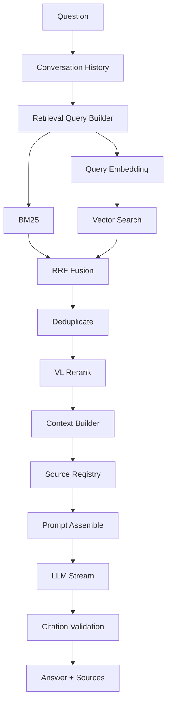

# 在线 RAG 流程契约

## 1. 目标

在线 RAG 在指定知识库的唯一 Active Index 中检索证据，通过 Hybrid Retrieval 与 VL Rerank 选取上下文，使用全局 Prompt 和对话历史生成流式答案，并返回只能指向真实 Chunk 的来源。供应商请求使用不可由检索内容覆盖的 system guard；问题、历史和检索片段均按不可信数据处理。

## 2. 请求前置条件

Chat 请求必须满足：

- Knowledge Base 存在且 `status=ENABLED`。
- 存在 `active_index_id`。
- Active Index 状态为 `ACTIVE` 且属于该知识库。
- 全局 Embedding、Rerank、LLM 和 Prompt 配置可用。
- Conversation 若存在，其 `knowledge_id` 与请求一致。

读取 Knowledge Base 后，本次请求冻结实际 `index_id`。即使请求过程中发生索引切换，本次请求仍使用开始时解析出的快照；后续新请求使用新 Active Index。

## 3. 全流程



每个阶段必须写入统一 `trace_id` 下的耗时和摘要。

## 4. Conversation History

- 读取最近的已完成 User/Assistant 消息。
- 失败、取消或仍在流式生成的 Assistant Message 不进入新 Prompt。
- History 受消息数和 Token Budget 双重限制，优先保留最近轮次。
- V1 不实现长期记忆或对话摘要持久化。
- 当前问题始终完整保留；History 不得挤占全部检索上下文预算。

默认 Retrieval Query 使用当前问题。为了支持指代式追问，`RetrievalQueryBuilder` 保留加入有限历史或调用 Query Rewrite 的扩展点；M4 基线测试确认之前不得默认增加额外 LLM Rewrite 调用。

## 5. Query Embedding

- 使用 Active Index 冻结的 Embedding 模型，而不是盲目使用当前全局最新配置；该模型输出必须匹配部署级固定维度。
- 如果对应历史模型配置已被禁用但索引仍 Active，查询端必须仍能解析可用 Provider；删除被 Active Index 引用的配置禁止。
- Query 向量校验维度和有限数值。
- Embedding 失败时本次 Chat 失败，不只执行 BM25 后伪装成完整 Hybrid Retrieval；是否允许显式降级由未来 ADR 决定。

## 6. 双路召回

### Vector Search

强制过滤：

```text
kb_id = request.knowledge_id
index_id = frozen_active_index_id
```

返回：

```text
chunk_id
rank
distance
normalized_similarity（仅展示，不用于直接跨引擎相加）
```

ANN 索引类型及探测参数在 M4 通过数据规模和延迟测试冻结。

### BM25

对相同 `kb_id + index_id` 下的 `search_text` 执行严格 BM25，返回：

```text
chunk_id
rank
bm25_score
```

中文 tokenizer、停用词与字段权重必须与构建时配置一致。

### 默认候选参数

M0 只冻结参数名称，不冻结生产数值：

```text
vector_top_k
bm25_top_k
fusion_top_k
rerank_top_n
context_max_chunks
context_token_budget
```

M4 使用样例文档和开发测试集确定默认值；所有取值有服务端上下限，Playground 只能在边界内覆盖。

## 7. 融合与去重

使用 Reciprocal Rank Fusion：

```text
rrf_score(chunk) = Σ 1 / (rrf_k + rank_in_result)
```

- 同一 `chunk_id` 合并 Vector 与 BM25 结果。
- 只在单路出现的 Chunk 仍可进入候选。
- `rrf_k` 为版本化配置。
- 不直接相加 Vector Similarity 与 BM25 Score。
- 排名分数相同时使用确定性规则，例如最佳单路排名、`chunk_id`，保证测试可重复。

对于高度重叠或内容完全相同的相邻 Chunk，融合后可以按文档、来源 Element 和规范化内容哈希去重；原始候选仍保留在 Trace 中。

## 8. VL Rerank

Rerank 输入由 Query 和融合候选组成：

- TEXT/TABLE：发送规范化文本。
- IMAGE：发送章节、OCR、Caption，并在 Provider 支持时发送图片。
- MIXED：发送文本、表格和受限数量图片。

Provider 结果必须检查：

- `index` 在输入范围内；
- 没有重复索引；
- 分数为有限数值；
- 输出条数不超过请求 `top_n`。

Rerank 超时、限流或 5xx 时，在线流程允许降级为 RRF 顺序：

```text
rerank_status = DEGRADED
rerank_degraded = true
```

协议错误或安全错误不得无声降级，必须记录明确错误。前端回答可继续，但 Trace 必须显示降级。

## 9. Context Builder

Context Builder 在 Rerank 后、来源编号分配前执行结构扩展：

1. 对疑似不完整或操作步骤 Child，读取同文档、同 Parent 的前后邻接 Child。
2. 只接受数据库中已注册且 `sequence_no` 连续的邻接关系。
3. 对扩展结果执行内容级去重和预算选择。
4. 最终选中内容按 Parent 内原文序号排列，然后才分配 `[S1]`、`[S2]`。

随后遵守：

1. 不超过 `context_token_budget`。
2. 不超过 `context_max_chunks`。
3. 优先保留高排名证据。
4. 可限制同一文档占比，避免一个长文档垄断上下文。
5. 不在 Chunk 中间进行破坏语义的字符截断；需要截断时使用可追踪的 Token 边界策略。
6. IMAGE/MIXED Context 的图片数量和总字节数受限制。
7. 每个选中 Chunk 注册唯一 `source_id`，按最终 Context 顺序分配 `S1`、`S2`……。

上下文格式示例：

```text
[S1]
文档：部署手册.docx
章节：部署指南 > 数据库配置
内容：数据库默认端口为 3306。

[S2]
文档：运维手册.docx
章节：连接参数
内容：...
```

来源标题和内容均来自服务端数据库，不接受模型生成的文档元数据。

## 10. Prompt 组装

全局 Active Prompt 必须包含：

```text
{{context}}
{{question}}
{{history}}
```

启用 Prompt 前验证：

- 三个必需变量都存在；
- 没有未识别变量；
- 渲染后总 Token 未超过模型预算；
- Prompt 指示模型仅根据 Context 回答；
- 无证据时明确表示知识库中没有足够信息；
- 引用只能使用 `[S<number>]`。

建议预算顺序：

```text
System Instructions
History
Retrieved Context
Question
Output Reserve
```

模型自身的 Thinking 参数属于 Provider 配置，不进入普通用户 Prompt，也不把思考过程返回给客户端或保存到 Trace。

## 11. LLM 与 SSE

在开始 LLM 请求前：

1. 创建 User Message。
2. 创建 `STREAMING` Assistant Message。
3. 创建 `RUNNING` RAG Trace。
4. 发送 `trace` 和允许引用的 `source` 事件。

LLM Delta 逐个转为 `message` 事件。服务端同时累积完整答案，但不得假设 Delta 按字符、词或 JSON 边界切分。

客户端断开：

- 取消上游请求；
- Assistant Message 标记 `CANCELLED`；
- Trace 标记 `CANCELLED`；
- 不发送后续事件。

LLM 正常结束：

- 校验引用；
- Assistant Message 写入完整答案和最终来源；
- Trace 写入完成状态、用量和耗时；
- 发送 `done`。

## 12. 引用校验

服务端维护：

```text
S1 -> real chunk metadata
S2 -> real chunk metadata
```

从答案识别 `[S1]` 等标记，并执行：

- 未注册的编号不得进入 `done.sources`。
- 重复编号只返回一次结构化来源。
- `done.sources` 按首次引用顺序返回。
- 模型写出的文件名、页码或 Chunk ID 不作为可信元数据。
- 答案没有任何有效引用时返回空数组，并在 Trace 中记录 `citation_missing=true`；V1 不自动伪造引用。

结构化来源：

```json
{
  "source_id": "S1",
  "document_id": "uuid",
  "document": "部署手册.docx",
  "section_path": ["部署指南", "数据库配置"],
  "page": null,
  "element_ids": ["uuid"],
  "chunk_id": "uuid"
}
```

`page` 只有可靠页面映射存在时才赋值，禁止根据段落数量估算页码。

## 13. Trace 与隐私

Trace 至少记录：

```text
request metadata
frozen index_id
history metadata
query embedding metadata
vector candidates
bm25 candidates
fusion candidates
rerank candidates
selected context
prompt（按配置）
answer（按配置）
sources
model usage
stage timings
degradation flags
error
```

完整 Prompt、问题和答案可能包含企业敏感数据。生产环境必须配置保存开关、最大长度、脱敏和保留期。密钥、Authorization、图片 Base64 和供应商鉴权错误永不保存。

## 14. M4/M5 验收场景

1. 两个知识库中存在相同关键词时只返回指定知识库内容。
2. 构建过程中 Chat 始终使用请求开始时冻结的 Active Index。
3. Vector 与 BM25 可分别查看，RRF 结果可重复。
4. Rerank 不可用时按 RRF 降级并记录标记。
5. Context 超限时按完整 Chunk 边界裁剪。
6. 模型生成不存在的 `[S99]` 时最终来源中不出现该引用。
7. 客户端断开后上游流被取消。
8. Conversation 不能跨知识库复用。
9. 无 Active Index、无模型配置和上游超时都返回约定错误。
10. `done.sources` 中的每个 Chunk、Element 和 Document 都真实存在且属于本次 `index_id`。
